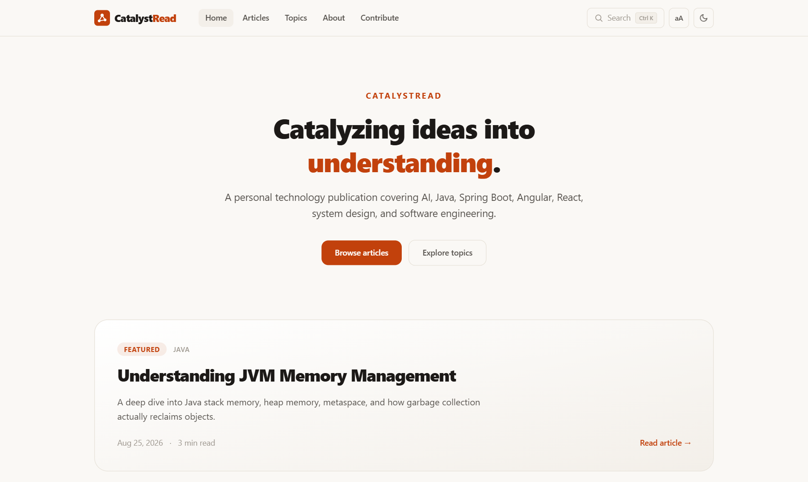
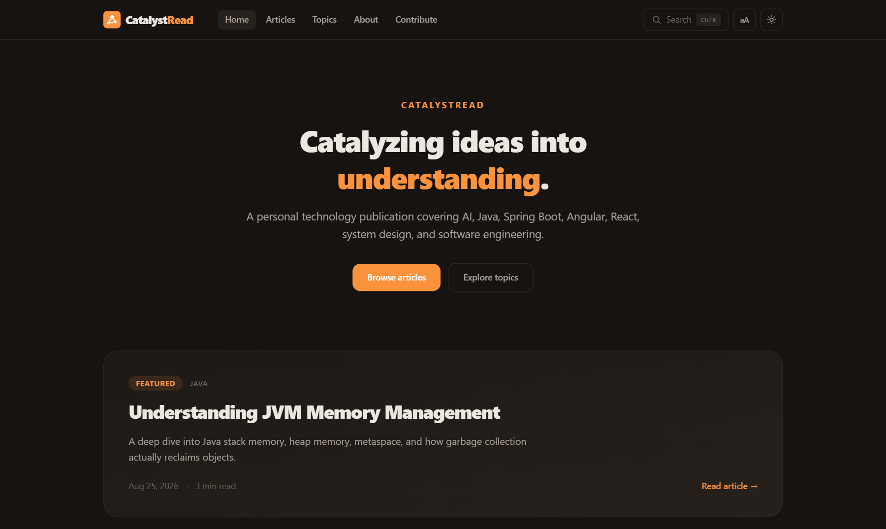
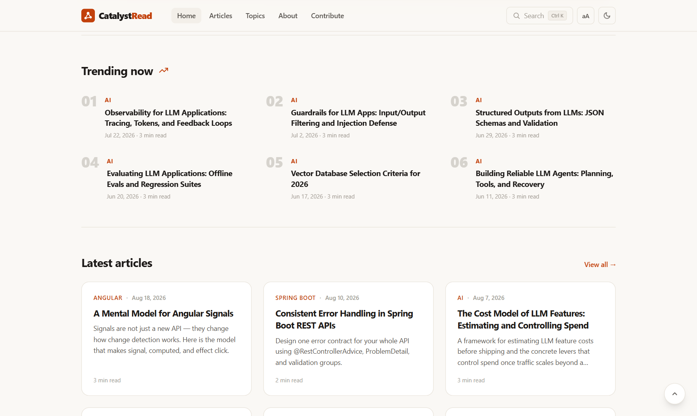
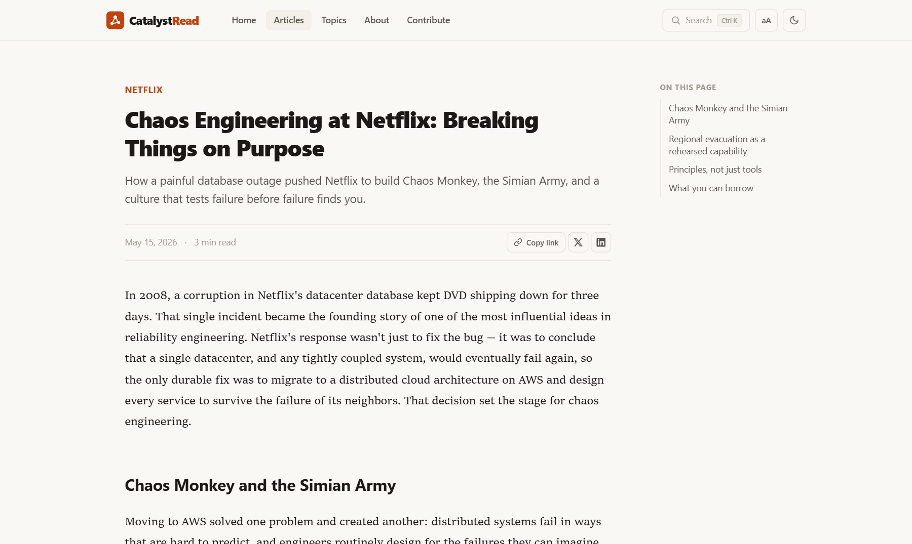
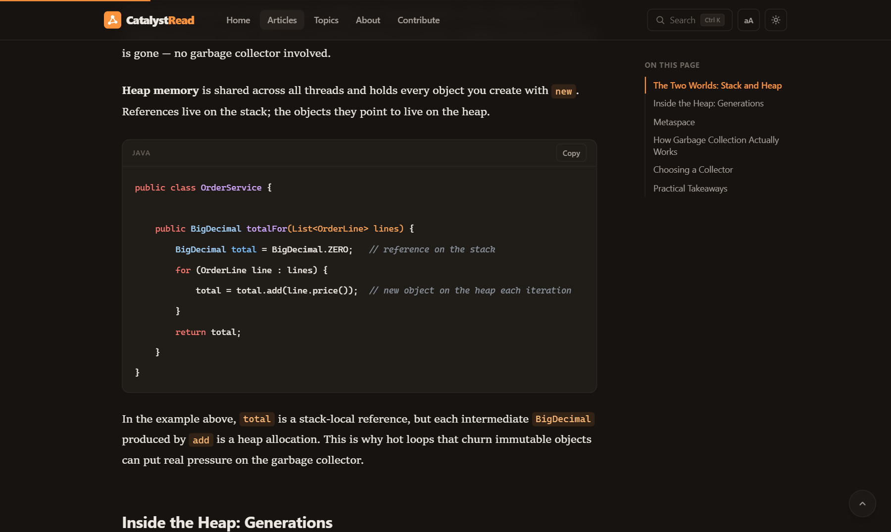
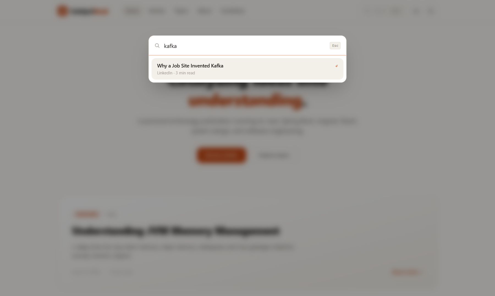
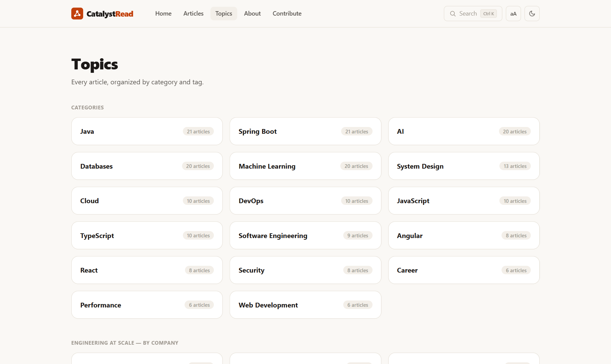

# CatalystRead

> **Catalyzing ideas into understanding.**

**🌐 Live site → [vivekkumarq.github.io/CatalystRead](https://vivekkumarq.github.io/CatalystRead/)**

CatalystRead is a personal technology publication covering AI, machine learning, Java, Spring Boot, Angular, React, system design, databases, DevOps, security, and how the world's best product companies engineer at scale — built as a **fully static, Markdown-driven site** with no backend, no database, and no CMS. Every article is a Markdown file; publishing is a git push.



## ✨ Highlights

- 📚 **220+ technical articles** across 30+ topics — from JVM internals and Spring Boot patterns to RAG architectures, Kafka's origin story at LinkedIn, and Netflix's chaos engineering
- ⚡ **Fully static & fast** — every route is prerendered to plain HTML at build time; the initial page transfer is ~120 kB
- ✍️ **Publish by pushing** — drop a `.md` file in the repo, push, and CI builds and deploys automatically
- 🎨 **Premium reading experience** — editorial typography, dark mode, reader-adjustable fonts, and subtle motion design

## 📸 A tour of the site

| | |
| :---: | :---: |
| **Dark mode** — remembers your choice, zero flash on load | **Trending & Latest** — a `trending: true` flag in frontmatter drives the ranked list |
|  |  |
| **Article pages** — scrollspy table of contents, copy-link & share actions, reading progress | **Build-time syntax highlighting** — zero highlighting JavaScript shipped to the browser |
|  |  |
| **Instant search** (`Ctrl+K`) — keyboard-navigable, across titles, topics, and tags | **Topics** — tech categories plus per-company "Engineering at Scale" pages |
|  |  |

## 🚀 Features

### Reading experience
- **Editorial typography** — a serif reading face for articles, sans-serif UI, tuned line lengths and rhythm
- **Reader preferences** — an `aA` menu with six font styles (Editorial, Serif, Classic, Sans, Modern, Mono) and three text sizes, applied site-wide and persisted per reader
- **Light & dark mode** — respects the system preference, remembers manual choice, no flash on load
- **Reading progress bar**, **scrollspy table of contents**, **copy-link and share buttons** (X, LinkedIn), and **copy buttons on every code block**
- **Subtle motion design** — staggered card entrances, scroll-reveal sections, animated page transitions, and a logo that reacts on hover; every animation is disabled automatically for `prefers-reduced-motion` users

### Content & discovery
- **Markdown-first publishing** — YAML frontmatter + Markdown body is the entire authoring format
- **Instant search** — `Ctrl+K` opens a keyboard-navigable dialog; a dedicated `/search` page supports shareable `?q=` links
- **Topics & tags** — every category and tag gets its own page automatically
- **Engineering at Scale** — a per-company category set (Netflix, Google, Uber, Amazon, Stripe, Discord, and more) telling real, documented architecture stories
- **Trending** — a frontmatter flag curates the ranked home-page list
- **Related articles** — recommended by shared tags and category, computed at build time
- **RSS feed and sitemap** — regenerated on every build

### Engineering
- **Fully prerendered** — 500+ routes rendered to static HTML at build time for real SEO and instant first paint
- **Lightweight by design** — article bodies and tables of contents ship as tiny lazy chunks (~2 kB each); the metadata index keeps the initial bundle at ~120 kB transfer
- **Zero runtime dependencies** beyond Angular — no component libraries, no CSS frameworks at runtime, system font stacks only
- **Guest contributions** — the [Contribute](https://vivekkumarq.github.io/CatalystRead/contribute/) page generates a ready-to-submit article file; submissions arrive by email or pull request and are published only after review

## 🛠 Tech stack

| Layer | Choice |
| ----- | ------ |
| Framework | Angular 22 (standalone components, signals, zoneless) |
| Language | TypeScript 6 (strict mode, strict templates) |
| Styling | Tailwind CSS v4 + semantic CSS custom properties |
| Content | Markdown + YAML frontmatter, compiled at build time |
| Highlighting | highlight.js, executed at build time (zero runtime cost) |
| Hosting | GitHub Pages via GitHub Actions |

Node.js is used only at development and build time. The deployed site is static files.

## ⚙️ How it works

```
src/content/posts/**/*.md
        │  npm run generate (scripts/generate-content.mjs)
        ▼
src/app/generated/           ← gitignored, rebuilt on every build
  posts.generated.ts           metadata, topics, search index, lazy loaders
  posts/<slug>.ts              rendered HTML + TOC, one lazy chunk per article
        │  ng build (prerender)
        ▼
dist/catalystread/browser/   ← static HTML/CSS/JS for every route
        │  scripts/generate-sitemap.mjs
        ▼
sitemap.xml, feed.xml, robots.txt, 404.html, .nojekyll
```

At build time, Markdown is rendered to HTML, code is syntax-highlighted, heading anchors and tables of contents are extracted, reading time is computed, and related articles are scored by shared tags and category. The browser downloads none of that machinery — each article ships as a small prerendered page plus a ~2 kB lazy chunk.

## 🏁 Quick start

```bash
npm install
npm start          # generates content, serves at http://localhost:4300
```

Other commands:

```bash
npm run generate       # rebuild generated content from src/content
npm run watch:content  # regenerate automatically while editing articles
npm run validate       # check all article frontmatter
npm run build          # full production build + sitemap into dist/catalystread/browser
npm test               # unit tests
```

To preview the production build locally:

```bash
npx http-server dist/catalystread/browser -p 8080
```

## ✍️ Publishing a new article

1. Create a Markdown file under `src/content/posts/<category-folder>/`, e.g. `src/content/posts/java/my-new-article.md`. (Folders are just organization — the `category` frontmatter field is what counts.)
2. Add frontmatter and write the article:

   ```markdown
   ---
   title: "Understanding JVM Memory Management"
   slug: "understanding-jvm-memory-management"
   description: "A deep dive into Java stack memory, heap memory, metaspace and garbage collection."
   publishedAt: "2026-09-01"
   category: "Java"
   tags:
     - Java
     - JVM
   ---

   Article content starts here…
   ```

3. Commit and push to `main`.

That's it. The article automatically appears in listings, search, its topic pages, related-article recommendations, the RSS feed, and the sitemap — no application code changes needed.

### Frontmatter reference

| Field | Required | Notes |
| ----- | -------- | ----- |
| `title` | yes | Article headline |
| `slug` | yes | Lowercase kebab-case, unique; becomes `/articles/<slug>` |
| `description` | yes | Shown on cards, search, and meta tags |
| `publishedAt` | yes | `YYYY-MM-DD`; drives sort order |
| `updatedAt` | no | `YYYY-MM-DD`; shown when different from `publishedAt` |
| `category` | yes | Exactly one, e.g. `"Java"`; becomes a topic page |
| `tags` | yes | List of strings; each becomes a topic page |
| `featured` | no | `true` promotes the article to the home hero |
| `featuredOrder` | no | Number; lower wins when several are featured |
| `trending` | no | `true` lists the article in the home Trending section |
| `coverImage` | no | Path under `/assets/images/articles/` |

`npm run validate` (also run in CI) rejects bad frontmatter with a precise error before anything deploys.

### Guest submissions

Readers can draft an article on the [Contribute page](https://vivekkumarq.github.io/CatalystRead/contribute/), which generates a complete `.md` file (correct frontmatter included) and offers it for download, clipboard copy, an email draft, or a pull request against this repository. Publishing a submission is the same as publishing any article: the file is reviewed, dropped into `src/content/posts/`, and pushed — nothing goes live without that explicit step.

## 🚢 Deployment

Deployment is fully automated by [`.github/workflows/deploy.yml`](.github/workflows/deploy.yml):

1. Every push to `main` triggers the workflow (it can also be run manually).
2. Content is validated, the site is built with the correct `--base-href` (auto-detected for project vs. user pages), and the sitemap and RSS feed are generated.
3. The static output is deployed to GitHub Pages.

No secrets or configuration needed — forks only need **Settings → Pages → Source: GitHub Actions** enabled once.

## 📁 Project structure

```
├── .github/workflows/deploy.yml   # CI: validate → build → deploy to Pages
├── docs/screenshots/              # README screenshots
├── scripts/
│   ├── lib/content.mjs            # shared: scan, validate, render Markdown
│   ├── generate-content.mjs       # emits src/app/generated/*
│   ├── validate-content.mjs       # frontmatter linter (used by CI)
│   └── generate-sitemap.mjs       # sitemap, RSS feed, robots.txt, 404.html
├── src/
│   ├── app/
│   │   ├── core/                  # models, services (posts, search, seo, theme, prefs), constants
│   │   ├── shared/                # header, footer, cards, search dialog, TOC, brand mark…
│   │   ├── features/              # home, articles, topics, search, about, contribute, 404
│   │   └── generated/             # build artifacts (gitignored)
│   └── content/posts/             # ✍️ articles live here
└── public/assets/                 # favicon, article images
```

## 📄 License

[MIT](LICENSE)
